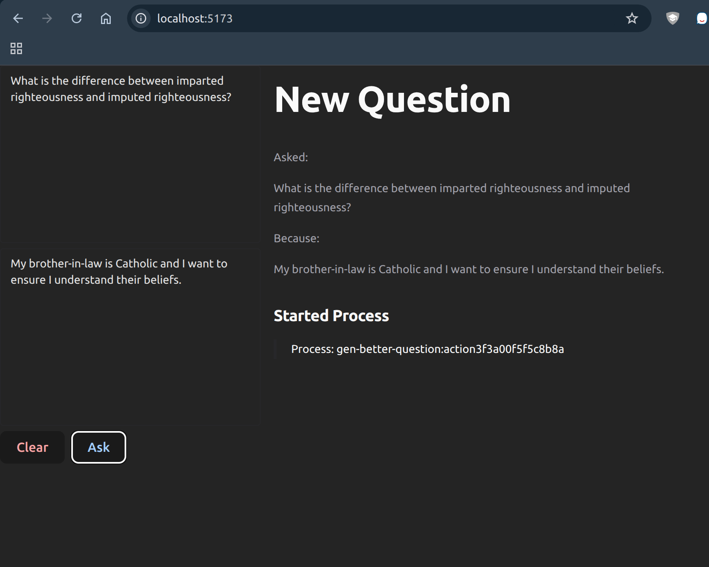
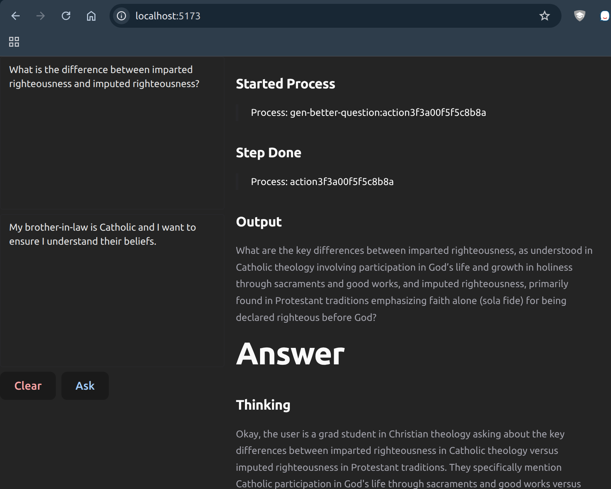
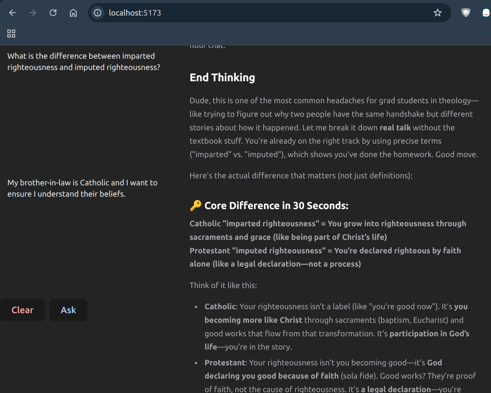

# Study Helper

## Development

### Tools

- Docker Compose
- pnpm
- node
- ollama

### Backing Services

> We don't use this for what we demo but all the same

```sh
cp .env-db.example .env.db # change to whatever you want
docker compose up -d
```

> Migrate DB

```sh
./scripts/goose up # or status or any other goose commands
```

### Install Local Deps

> Note: I had issues getting the client to install correctly
> the first time I got it going. May need to use npm install
> of pnpm. Or yarn. idk

```sh
cp .env.example .env.local # change to whatever you want
pnpm install && cd client && pnpm install
```

### Pull Local Models

```sh
# Change to whatever models you set in your env vars
ollama pull phi4-mini
ollama pull phi4
ollama pull qwne3:4b

# This is for our embeddings
ollama pull ollama pull ryanshillington/Qwen3-Embedding-0.6B
```

### Start Locally

> In one terminal, start server, assuming DBs and Ollama running

```sh
pnpm dev:api
```

> In another terminal, start client, assuming APIs running

```sh
pnpm dev:client
```

## Ingest

> If this doesn't work, create a PR to fix it

```sh
cd workers/ingest
source ./bin/activate
pip install -r requirements.txt
python3 app.py
```

## Chunk

> If this doesn't work, create a PR to fix it

```sh
cd workers/chunk
source ./bin/activate
pip install -r requirements.txt
python3 app.py
```

### File Explorer

You can use `http://localhost:9994` to use Console to explore
the Object Storage/File Server MinIO. It is an S3-compatible
storage for all of the files we will be ingesting.

## Screenshots

> Basic LLM Flow Working





## API

- `POST /ingest`
  - Body: `{"url": "url to ingest", "metadata": {"anything": "idk" } }`
  - This will kick off a pipeline of
    1. Downloading the file into MinIO
    2. Chunk the file
    3. embed chunks and save both to Postgres
- `POST /ask`
  - Body: `{ "query": "What you want to ask", "why": "Why you want to ask it" }`
  - This will trigger some LLM stuff see screenshots above
